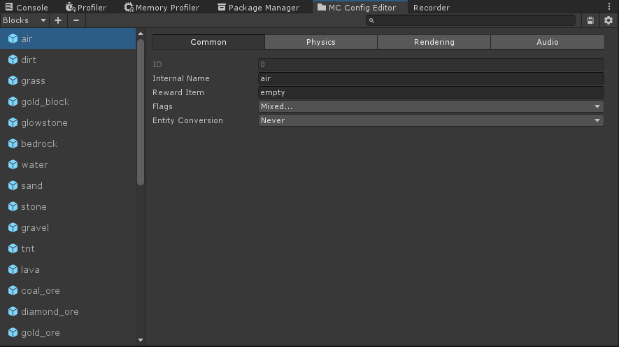
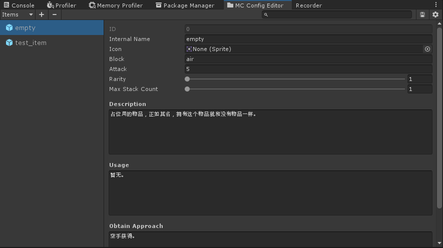
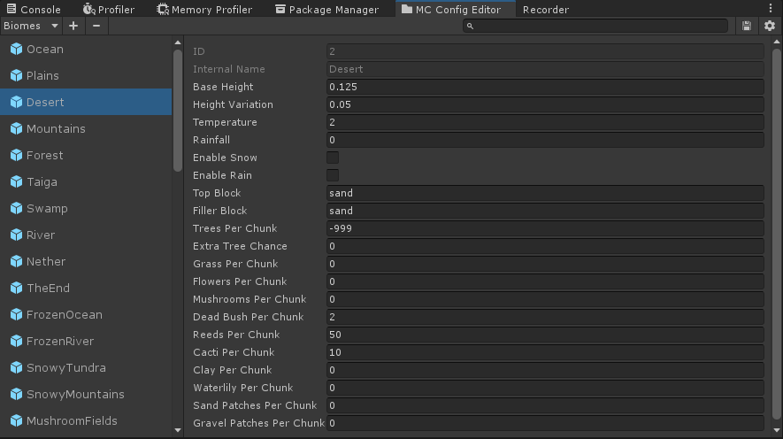

# Minecraft Demo

本项目使用 `Unity 2021.3.8f1c1` 制作。

**以下图片均为游戏内实际画面。**


# Features

* 无限世界，随机地形
* 生物群系（热带稀树草原、沙漠、森林、沙滩、MORE+）
* 矿洞、矿脉（钻石矿、煤矿、金矿、MORE+）
* 光照、环境光遮蔽、阴影
* 萤石、火把
* 飘动的树叶
* 树木
* 半砖（暂不支持合并）
* 支持弹性碰撞的粘液块（项目未使用 Unity 内置的物理系统，自己写了一个简单版）
* 能爆炸的 TNT（有粒子特效）
* 受重力影响的沙子和沙砾
* 可流动的水和岩浆（有最大流动格数的限制，一格水不会淹没整个世界（笑））
* 方块朝向（旋转）
* 昼夜更替
* URP渲染管线 + 全 PBR 材质（[支持 NVIDIA 的 Minecraft PBR 材质包](https://www.nvidia.cn/geforce/guides/minecraft-rtx-texturing-guide/)）
* 后处理特效
* 可自定义的资源包
* 方块数据、生物群系数据、物品数据高度可配置
* 一些 ~~bug~~ 特性


# Notice

* 项目使用的材质包是在 [“我的世界 (Minecraft)”Windows 10 RTX Beta版：基于物理效果的渲染纹理答疑和免费资源包下载 (nvidia.cn)](https://www.nvidia.cn/geforce/news/minecraft-with-rtx-beta-your-pbr-questions-answered/) 下载的 `RTX Vanilla Conversion`，其创作者为：u/TheCivilHulk。也可以直接在 [TheCivilHulk/Minecraft-RTX-Vanilla-Conversion-and-Patches: Converted all (currently working) vanilla textures to the Minecraft Bedrock RTX format for testing/playing purposes. (github.com)](https://github.com/TheCivilHulk/Minecraft-RTX-Vanilla-Conversion-and-Patches) 下载。
* 随缘更新！


# Guide

## How To Play In Unity?

1. 打开 SinglePlayer 场景
2. 点击播放按钮
3. 根据屏幕上的键位提示进行游戏

## Asset Management

在编辑器下支持两种资源加载模式：

* 从 `AssetDatabase` 加载（适合开发时使用，不需要构建 `AssetBundle`，对资源的修改立即生效）

* 从 `AssetBundle` 文件中加载（适合测试时使用，需要构建 `AssetBundle`）

两种模式只需要在 Unity 菜单栏 `Minecraft-Unity/Assets/Load Mode` 中切换即可，它们共享同一套 API，上层逻辑不需要在意。

代码示例：

```c#
// 首先，确保场景中有挂载 AssetManagerUpdater 组件，并设置了相关属性，或者自己已经手动初始化了 AssetManager.
using Minecraft.Assets; // 全在这个命名空间里.

class Example : MonoBehaviour
{
    // 直接保存资源的路径，如：Assets/MyFolder/MyAsset.asset.
    public string AssetPath;

    // 保存资源的“地址”（推荐）.
    // 在 Inspector 中，这个字段和普通的 Object 引用没有任何区别.
    // 内部保存了资源的 GUID，也就是说即使资源位置被移动、名称被修改，引用仍然不会丢失！
    public AssetPtr Asset;

    private IEnumerator Start()
    {
        // 全异步架构.
        // 不需要关心资源具体在哪个 AssetBundle 中.
        AsyncAsset asset = AssetManager.Instance.LoadAsset<GameObject>(Asset); // 也可以用 AssetPath.
        yield return asset; // 等待资源加载完成.

        GameObject go = asset.GetAssetAs<GameObject>(); // 获取具体的对象.

        // do something.

        AssetManager.Instance.Unload(asset); // 卸载资源.（这里也可以用资源的名称来卸载）
    }
}
```

上面的示例只是最基本的使用，更多 API 就请看源码吧（毕竟这个不是重点）。

构建 `AssetBundle`：在 Unity 菜单栏中点击 `Minecraft-Unity/Assets/Build AssetBundles` 就行了，会自动打包为当前发布平台的资源包，然后放到指定路径。


## Configuration

方块数据、物品数据（暂时还没用）、生物群系数据都在一个自定义的编辑器中进行配置。

在 Unity 菜单栏中点击 `Minecraft-Unity/MC Config Editor` 即可打开，界面如下图：











### Tips

1. 工具栏左边的下拉菜单可以切换当前编辑的数据（Blocks / Items / Biomes）
2. 点击工具栏上的 加号 或者 减号 可以 添加 或者 删除 一个数据项（Block / Item）
3. 工具栏右侧从左往右分别是：搜索框、保存按钮、设置按钮
4. 点击设置按钮可以修改配置文件的保存路径，在一开始用的时候记得先把保存路径设置好
5. 我做好的配置文件都保存在：`Assets/Minecraft Default PBR Resources/Tables/Configs`
6. 如果你不想另起炉灶的话，在刚打开这个编辑器后就把路径设置为第5条中的路径
7. 保存的配置文件有一大坨，其中文件名前加了 `[editor]` 的都是只在 Unity Editor 下使用的
8. 如果想知道第7条中提到的文件有啥作用的话，请看源码吧，这里空间太小，我写不下（费马行为）
9. 如果还有啥问题就提个 issue 问我吧，我想不出来了


## Lua Codes

Lua 代码我都放在了 `Assets/Minecraft Default PBR Resources/Lua Scripts` 路径下。其中 `main.lua` 作为 Lua 代码的 Entry Point，`cleanup.lua` 用来释放资源。如果想修改这些设置，可以在 Hierarchy 中找到 `Lua Manager` 来修改。

`Minecraft.Lua` 命名空间下提供了 `ILuaCallCSharp`、`ICSharpCallLua`、`IHotfixable` 这些空接口，相信熟悉 xlua 的人马上可以看懂。举个栗子，实现 `ILuaCallCSharp` 这个接口，等于给类打上了 `XLua.LuaCallCSharpAttribute`。


### Write Custom Block Behaviours

首先，创建一个 Lua 文件，然后设置好它的 AssetBundleName。

然后，这里先以沙子为例：

```lua
require "block" -- 引入这个模块，这里定义了方块行为的 API
local gravity = require "blocks.templates.gravity" -- 引入我提供的一个行为模板，这里用的是重力的模板
sand = create_block_behaviour(gravity) -- 直接继承，完成
-- 注意：sand 这个变量一定要是 global 变量，而且名字要和之前在编辑器配置的名称一致
```

写完以后，别忘记在 `main.lua` 里 `require` 一下。最后再提一下 `block` 这个模块，先看下简短的源码：

```lua
-- 文件路径：Assets/Minecraft Default PBR Resources/Lua Scripts/block.lua

local behaviour = {} -- 默认行为

-- 方块行为被注册时调用
function behaviour:init(world, block)
    self.world = world
    self.__block = block
    print("init block behaviour: " .. block.InternalName)
end

-- 边上的方块刷新时调用
function behaviour:tick(x, y, z)
    -- default implement
end

-- 方块被放置后调用
function behaviour:place(x, y, z)
    -- default implement
end

-- 方块被破坏后调用
function behaviour:destroy(x, y, z)
    -- default implement
end

-- 方块被点击后调用
function behaviour:click(x, y, z)
    -- default implement
end

-- 方块实体初始化时调用
-- entity 参数就是方块实体对象
-- context 参数就是一个 LuaTable，可以用来保存一些临时数据（切勿直接 self.xxx = xxx）
-- 下同
function behaviour:entity_init(entity, context)
    -- default implement
end

-- 方块实体被销毁时调用
function behaviour:entity_destroy(entity, context) 
    -- default implement
end

-- 方块实体的 Update 方法
function behaviour:entity_update(entity, context)
    -- default implement
end

-- 方块实体的 FixedUpdate 方法
function behaviour:entity_fixed_update(entity, context)
    -- default implement
end

-- 方块实体被碰撞时调用
-- flags 参数就是 UnityEngine.CollisionFlags
function behaviour:entity_on_collisions(entity, flags, context)
    -- default implement
end

-- 获取该行为对应的 BlockData 对象
function behaviour:get_block_data()
    return self.__block
end

--- 创建一个方块行为对象。
---
--- 如果不传入 `base` 参数，返回的对象将具有默认行为。
---
--- 如果传入 `base` 参数，返回的对象将会继承 `base` 的所有行为。
---
--- @param base? table
--- @return table
function create_block_behaviour(base)
    return setmetatable({
        base = base or behaviour
    }, {
        __index = function(table, key)
            local block = rawget(table, "__block")
            return block and block[key] or rawget(table, "base")[key]
        end
    })
end
```

这个模块允许我们像定义一个类一样去定义方块行为，非常方便。另外，我提供了 `blocks.templates.gravity` 和 `blocks.templates.fluid` 两种模板，用于快速实现重力和流体的行为。如果要实现更复杂的行为，就要自己写代码了。


## Terrain Generation

在 `Assets/Minecraft Default PBR Resources/WorldGen` 路径下保存了许多地形生成相关的配置文件，可以自己修改参数、增加生成器来改变地形。


# End

如果还有问题就提一个 issue 吧，我看到后会回复的。


# References

**排名不分先后**

* [TrueCraft](https://github.com/ddevault/TrueCraft)
* [xLua](https://github.com/Tencent/xLua)
* [MineCase](https://github.com/dotnetGame/MineCase)
* [MineClone-Unity](https://github.com/bodhid/MineClone-Unity)
* [MinecraftClone](https://github.com/Shedelbower/MinecraftClone)
* [Making a Minecraft Clone](https://www.shedelbower.dev/projects/minecraft_clone/)
* [Minecraft_Wiki](https://minecraft-zh.gamepedia.com/Minecraft_Wiki)
* [炒鸡嗨客协管徐的CSDN博客](https://blog.csdn.net/xfgryujk)

